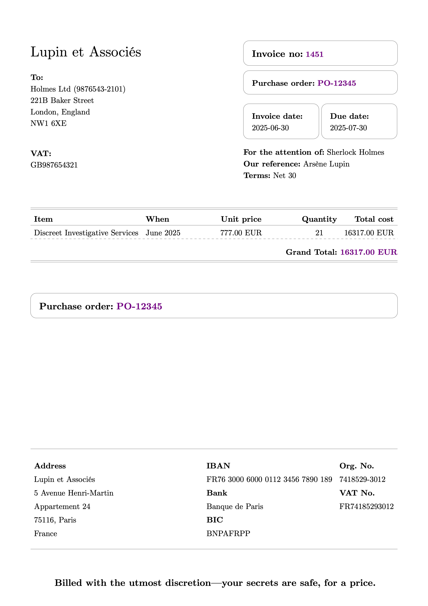

[](https://codecov.io/gh/Sajjon/klirr)

**Tired of manual bumping invoice number, calculating number of working days and looking up exchange rates and converting expenses into your currency?**

**Do you prefer automation? Then klirr is something for you!**

# Klirr

Klirr is a config **once**, inter-month-idempotent, calendar aware, capable and **maintenance-free** invoice solution written in Rust + [Typst](https://github.com/typst/typst).

> [!TIP]
> Scroll down to example invoice in the bottom to see what the invoice looks like.

# Features

-   Config once: Set your company, client and project information using interactive Terminal UI (creates RON files). **No Rust, Typst or [RON][ron] skills needed!**
-   Inter-month-idempotent: You build the invoice any number of times, it always results in the same invoice number when run within the same month. The proceeding month the next invoice number will be used.
-   Calendar aware: Using your machines system time to determine the month, it calculates the number of working days for the target month. Invoice date is set to last day of the target month and due date is set dependent on the payment terms set in your RON files.
-   Capable: Supports setting number of days you were off, to be extracted from the automatically calculated number of working days. Supports expenses using `"{PRODUCT}, {COST}, {CURRENCY}, {QUANTITY}, {DATE}"` CSV string.
-   Maintenance free: The invoice number automatically set based on the current month. When you build the invoice the next month, the next number is used.

# Installation

## Required Software

### Rust

You need [Rust](https://www.rust-lang.org/tools/install) to use this software.

## Install `klirr`

```bash
cargo install klirr
```

# Usage

You can try klirr out with sample data before you set it up with your information if you want. Try running:

```bash
klirr sample
```

## Init

Before you can use `klirr` to generate invoices you need to provide information about your company, the client, your payment details, and other info, do it using interactive terminal ui (TUI) by running:

```bash
klirr data init
```

You will be prompted

After setup is complete, you should have the following files in `$DATA_PATH/klirr/data` (
`$DATA_PATH` depends [on OS][data_path], so full path is `$HOME/Library/Application Support/klirr/data` on macOS):

1. `vendor.ron`
1. `client.ron`
1. `invoice_info.ron`
1. `payment.ron`
1. `service_fees.ron`
1. `expenses.ron`

These files use [`RON` ("Rusty Object Notation")][ron] file format, a modern object notation superior to JSON/YAML/TOML.

### Manually Update

You can of course manually edit the files in the data folder by opening them up in your favourite text editor.

You can at any time validate the data by running:

```bash
klirr data validate
```

## Generate Invoice

```bash
klirr invoice
```

or for current month instead of last:

```bash
klirr invoice -- --month current
```

or if you want to configure output:

```bash
klirr invoice -- --output $HOME/my/custom/path/my_custom_name_of_file.pdf
```

> [!NOTE]
> If you don't specify `output` path the invoice will be saved in
> `$HOME/invoices`.

### Out of office for some days?

If you did not work for some days, and you need to not invoice for those days, e.g. `6` days off, use:

```bash
klirr invoice ooo 6
```

### Took vacation a whole month or parental leave?

You can ensure klirr uses correct invoice number calculations if you need to skip invoicing completely some months by marking said month(s) as "months off". You do it by:

```bash
klirr data month-off --month "2025-06"
```

Which will write to `$DATA_PATH/klirr/data/invoice_info.ron`

> [!TIP]
> There is currently no support for subtracting/removing expenses using Cli, if you made a mistake
> or otherwise wanna perform some changes, manually edit the file `$DATA_PATH/klirr/data/invoice_info.ron` > $DATA_PATH depends [on OS][data_path], but
> typically `$HOME/Library/Application Support` on macOS
> using your favourite text editor.
>
> After edit you can validate the data with:
>
> `cargo run --bin klirr data validate`

This ensures that there are no gaps in invoice numbers.

## Invoice for expenses

First add the expense, then generate the invoice.

### Add expenses

```bash
klirr data expenses --month 2025-05 -e "Sandwich, 6, EUR, 1, 2025-05-31" -e "Lunch, 11, GBP, 2, 2025-05-31"
```

> [!NOTE]
> The transaction day might be a different month than the value you put in `--month`, e.g. if
> if you had an expense on last of June but wanna include that expense in the invoice made in July
> should save the expense under July.

> [!NOTE] > `klirr data expenses` will aggregate identical expenses (disregarding `quantity`) under one entry and sum
> up the quantity. So if you run the `klirr data expenses` twice with identical input and lets say one expense
> item having quantity `2`, if you run it lets say four times, it will still show as one entry but with a
> quantity of `8`.

> [!TIP]
> There is currently no support for subtracting/removing expenses using Cli, if you made a mistake
> or otherwise wanna perform some changes, manually edit the file `$DATA_PATH/klirr/data/expenses.ron` > $DATA_PATH depends [on OS][data_path], but
> typically `$HOME/Library/Application Support` on macOS
> using your favourite text editor.
>
> After edit you can validate the data with:
>
> `cargo run --bin klirr data validate`

### Generate expenses invoice

Then generate the expenses invoice:

```bash
klirr invoice expenses
```

> [!NOTE]
> Exchange rates will be cached in `$DATA_PATH/klirr/data/cached_rates.ron` keyed
> under the `(Date, FromCurrency, ToCurrency)` triple, to not burden the exchanges
> API unnecessarily and to make klirr extra fast for you.

# Development

Interested in development? See [development guide](DEVELOPMENT.md)

# How it works

Interested in how it works? See [explanation guide](HOW_IT_WORKS.md)

# Etymology

Klirr is a Swedish 🇸🇪 an onomatopoeia word meaning "clink" - the sound of coins falling onto a hard surface. It is part of the Swedish idiom "klirr i kassan" (_"clink in the cash register"_) meaning "cash flow", income you get from invoicing!

# Example

This is an example of the _Aioo_ `Layout` rendered using `English`.

[](assets/example.jpg)

[ron]: https://github.com/ron-rs/ron
[data_path]: https://docs.rs/dirs-next/latest/dirs_next/fn.data_local_dir.html
